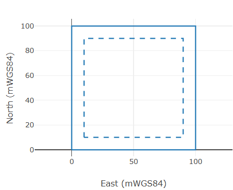
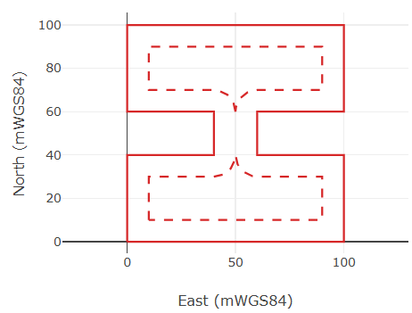
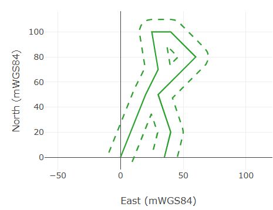

# Model Project

The Model project contains the domain types and supporting utilities for the Field microservice. It defines the core data models exchanged by the Service REST API and used by the managers for persistence and processing.

## Purpose

- Provide strongly typed models for the Field microservice (Field, FieldCartographicConversionSet, FieldCartographicConversionSetLight, field features, field memberships, field identities, and delineation lines).
- Centralize lightweight logic and contracts used across Service, WebApp, and tests.
- Track per-endpoint usage metrics via UsageStatisticsField, persisted periodically for diagnostics.

## Key Types

- Field: Represents a field entity with identity (`MetaInfo.ID`), name/description, timestamps, a cartographic projection reference (`CartographicProjectionID`), an optional reference point, feature assignments, identity assignments, membership assignments, and delineation lines.
- FieldFeatureCategory, FieldFeatureOption, FieldFeatureAssignment: Define user-managed feature categories/options and selected field feature options, with exclusivity and optional validity periods.
- FieldMembershipCategory, FieldMembershipOption, FieldMembershipAssignment: Define user-managed membership categories/options and selected field membership options, with behavior similar to features.
- FieldIdentity and FieldIdentityAssignment: Define user-managed symbolic identity names and field-specific identity values such as official names, external database IDs, WITSML UIDs, or report IDs.
- FieldDelineationLineType, FieldDelineationLine, FieldDelineationBoundaryLine: Define managed delineation line types, input line geometry, optional margin/depth ranges, and calculated boundary lines.
- FieldCartographicConversionSet: Input/output payload for cartographic ↔ geodetic conversions related to a given Field; includes `FieldID` and a list of `CartographicCoordinate` items (from ModelSharedIn).
- FieldCartographicConversionSetLight: Lightweight view of conversion set metadata and basic field info.
- UsageStatisticsField: Aggregates per-day counters for REST endpoints (GET/POST/PUT/DELETE) for both Field and FieldCartographicConversionSet resources, with periodic JSON backup to `../home/history.json`.

Namespaces: All types live under `NORCE.Drilling.Field.Model`.

## Delineation Line Margins

`FieldDelineationLine` stores the user-entered polyline and its optional margin. The input geometry is expressed as a series of `Point3DGlobalCoordinates`; the margin is a `LengthStandard` value converted and stored in SI. Boundary lines are calculated by the Service when a Field is created or updated, and the calculated result is stored as `FieldDelineationBoundaryLine` entries on the delineation line.

For a closed delineation line, the margin is applied toward the interior of the closed region. A square from `(0, 0)` to `(100, 100)` with a 10 m margin therefore produces an inner square from approximately `(10, 10)` to `(90, 90)`, not an outer square. The original line remains the solid line and the calculated boundary is drawn as a dashed line:



For a non-convex closed line, the same inward offset rule is used, but the boundary may no longer be a single simple polygon. Re-entrant shapes can create intersections between offset segments. These intersections are used to split and trim the calculated boundary so that areas where there is no remaining room for the margin are removed. Depending on the geometry and the margin value, this can yield several closed boundary lines, a smaller set of disconnected regions, or no boundary at all if the margin fully consumes the interior:



For an open delineation line, there is no interior/exterior region. The margin is applied on both sides of the input polyline, producing one offset boundary per side before intersection cleanup. If an offset boundary intersects itself, or if a boundary from one side intersects a boundary from the other side, the algorithm closes the overlapped part into a polygon and trims the remaining open boundary where there is no valid margin corridor. This is why one side of an open non-convex line can become a closed polygon plus a shorter open polyline, while the other side remains one continuous open polyline:



At each vertex, the boundary is built from offset segments plus, when needed, a circular arc centered on the original vertex. If the two adjacent offset segments intersect in the valid direction, the intersection point is enough and no arc is inserted. If the turn opens away from the offset side, including obtuse-angle cases, a constant-distance boundary cannot be represented by only the two offset segments; a circular arc of radius equal to the margin is discretized into small line segments and inserted between them. Thus arc insertion is decided locally for each pair of adjacent segments, and a single delineation line may contain corners with arcs and corners without arcs.

Top and bottom depth limits are optional. If both are missing, the delineation applies at any depth. If only top is defined, it applies below top; if only bottom is defined, it applies above bottom; if both are defined, it applies between them. Equality between top and bottom is accepted.

## Dependencies

- .NET: `net8.0`
- NuGet packages:
  - `OSDC.DotnetLibraries.General.DataManagement` (MetaInfo, JSON settings, etc.)
  - `OSDC.DotnetLibraries.General.Common`
  - `OSDC.DotnetLibraries.General.Statistics`
  - `OSDC.DotnetLibraries.Drilling.DrillingProperties`
- Project reference:
  - `ModelSharedIn` — shared input DTOs (e.g., `CartographicCoordinate`, geodetic types) used by conversion models.

See `Model/Model.csproj` for exact versions.

## Integration in the Solution

- Service (ASP.NET Core):
  - Controllers (`Service/Controllers/*Controller.cs`) accept and return these models.
  - Managers (`Service/Managers/*Manager.cs`) serialize/deserialize these models to SQLite and orchestrate calls to external microservices.
  - `UsageStatisticsField` is invoked from controllers to increment usage counters per endpoint.
- ModelSharedOut: NSwag-generated client and DTOs used by tests and possibly the WebApp to call the Service. These are compatible with the models defined here.
- WebApp: Displays and edits entities shaped by these models through the Service API.
- ServiceTest: Uses the NSwag `Client` to exercise endpoints that return/accept the models defined here.

## Usage Examples

Create and POST a Field through the Service API (shape of the payload comes from this project):

```csharp
using NORCE.Drilling.Field.ModelShared; // NSwag client/DTOs

var baseUrl = "https://localhost:5001/Field/api/";
var http = new HttpClient(new HttpClientHandler { ServerCertificateCustomValidationCallback = (_,_,_,_) => true })
{ BaseAddress = new Uri(baseUrl) };
var client = new Client(baseUrl, http);

var fieldId = Guid.NewGuid();
var field = new Field
{
    MetaInfo = new MetaInfo { ID = fieldId },
    Name = "My Field",
    Description = "Sample",
    CreationDate = DateTimeOffset.UtcNow,
    LastModificationDate = DateTimeOffset.UtcNow
};

await client.PostFieldAsync(field);
var fetched = await client.GetFieldByIdAsync(fieldId);
```

Prepare a FieldCartographicConversionSet payload:

```csharp
var fccs = new FieldCartographicConversionSet
{
    MetaInfo = new MetaInfo { ID = Guid.NewGuid() },
    Name = "Conversion Set",
    Description = "Sample",
    FieldID = fieldId,
    CartographicCoordinateList = new List<CartographicCoordinate>
    {
        new CartographicCoordinate
        {
            Northing = 1000,
            Easting = 2000,
            VerticalDepth = 50
        }
    }
};

await client.PostFieldCartographicConversionSetAsync(fccs);
```

Record a usage event (inside Service):

```csharp
UsageStatisticsField.Instance.IncrementGetAllFieldIdPerDay();
```

## Notes and Conventions

- Serialization: Types are designed for System.Text.Json. Default constructors exist for JSON compatibility.
- Persistence: Managers serialize full objects into SQLite text columns as JSON, alongside selected scalar columns for querying. Field assignments, delineation lines, and calculated boundaries are persisted as part of the serialized Field object.
- History backup: `UsageStatisticsField` writes to `../home/history.json` every few minutes. Ensure the `home` directory exists with write permissions in the Service runtime context.

## Building

- Restore and build from the solution root:

```bash
 dotnet build Field.sln
```

The Model project builds as a class library targeting .NET 8 and is referenced by the Service and other projects in this solution.

## Funding

The current work has been funded by the [Research Council of Norway](https://www.forskningsradet.no/) and [Industry partners](https://www.digiwells.no/about/board/) in the framework of the center for research-based innovation [SFI Digiwells (2020-2028)](https://www.digiwells.no/).

## Contributors

- Eric Cayeux, NORCE Energy Modelling and Automation
